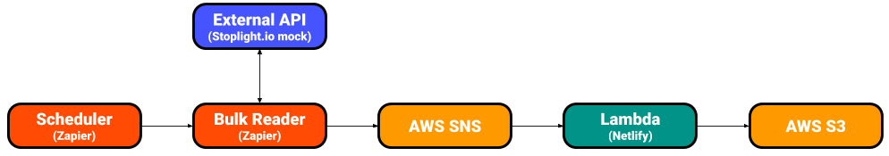
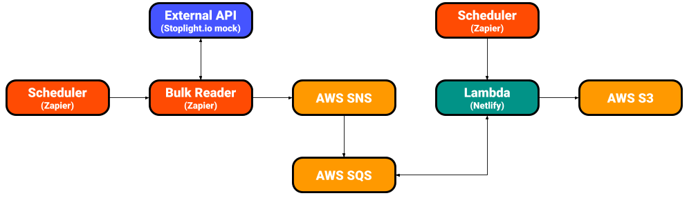

# Toolspalooza

This proof of concept combines few of the tools available to the team to implement a serverless ETL _(extract, transform, load)_ as described in the picture below.

A scheduler _(implemented with Zapier)_ triggers the first function _(implemented again with Zapier)_ that polls an external API _(just a mock implemented with Stoplight.io for this example, but it can be any REST API)_ and pushes each item from the result to an SNS topic. Each item in the topic is then POSTed to a simple function _(implemented in JavaScript with Netlify)_ that filters the input _(only red wines with a rating greater than 3)_ and stores each "wine" as a JSON document in S3. Following image shows a possible variant:

In this version, SNS pushes to an SQS queue. Then Netlify polls from the queue and everything goes as described before. A second scheduler is required as SQS can't push to a REST endpoint _(but it can trigger an AWS Lambda, so it'd be enough to use Lambda rather then Netlify)_. The advantage of this approach is that, when Netlify fails to process an item for whatever reason, the job is automatically re-enqueued and retried. It is also possible to introduce a dead-letter queue for jobs that failed more than _n_ times, so that someone has to actively figure out what's wrong with that particular item.

## Pros

* **Highly scalable:** No matter the number of jobs, this architecture scales automatically to handle _(almost)_ any volume of traffic.
* **Reduced Ops work:** Netlify and Zapier make everything very easy to deploy, so devs can focus on business logic and quality.

## Cons

* **Lots of moving parts:** This architecture can make debugging harder in production. A possible solution would be to unify logs and monitoring with solutions such as Splunk and CloudWatch _(or equivalent)_.

## Tools

### Zapier

* [Zap](https://zapier.com/app/zaps): functions to poll the external API and push results to SNS

## AWS

* [SNS Topic](https://ap-southeast-2.console.aws.amazon.com/sns/v3/home?region=ap-southeast-2#/topic/arn:aws:sns:ap-southeast-2:595545180516:poc-serverless-etl): Subscription must be confirmed. SNS will push a message containing a confirmation URL. Grab such URL from the Netlify logs and open it in a browser.
* [Zapier AWS user](https://console.aws.amazon.com/iam/home?region=ap-southeast-2#/users/poc-serverless-etl-zapier): has been granted permissions only for the SNS topic
* [Netlify AWS user](https://console.aws.amazon.com/iam/home?region=ap-southeast-2#/users/poc-serverless-etl-netlify)
* [S3 Bucket](https://s3.console.aws.amazon.com/s3/buckets/poc-serverless-etl/?region=ap-southeast-2&tab=overview)

## Netlify Function

* Endpoint: https://poc-serverless-etl.netlify.app/.netlify/functions/stock-great-wines
* Logs: https://app.netlify.com/sites/poc-serverless-etl/functions/stock-great-wines
* Guide to Netlify + S3: https://www.dferber.de/how-to-write-files-to-aws-s3-from-netlify-functions/

### About Netlify CLI

* **Install CLI:** `npm install netlify-cli -g`
* **Init CLI:** `netlify init`
* **List functions:** `netlify functions:list`
* **Invoke function**
  * Run `netlify dev` in a separate tab, then
    * `netlify functions:invoke stock-great-wines --identity`, or
    * `curl -X POST "http://localhost:8888/.netlify/functions/stock-great-wines" -d "{'spam': 'eggs'}"`

## Mock upstream server

Data source is available as mock at https://geobricks.stoplight.io/mocks/geobricks/poc-serverless-etl/563013/wines. The schema for the response is defined at `./upstrams/wines.yml`.
